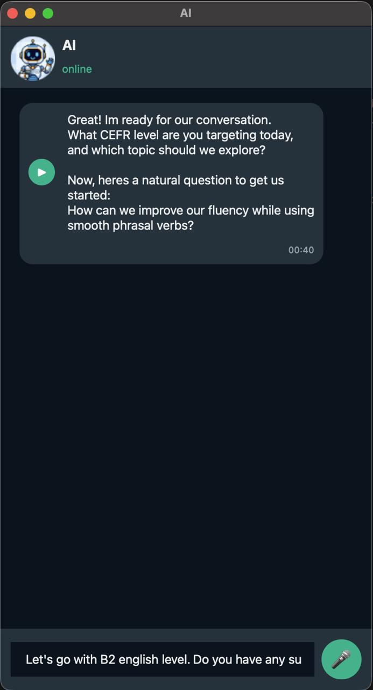

# Local English Tutor 🎓🤖

A privacy-focused, local AI-powered English tutor with a WhatsApp-inspired interface. Speak or type to interact with your AI tutor, featuring high-quality voice transcription and synthesis—all running locally on your machine.



## Features 🚀

-   **Adaptive Learning**: Supports all CEFR levels (A1 to C2) with context-aware responses and corrections.
-   **Voice-First Interaction**: Transcribe your speech in real-time using `faster-whisper`.
-   **Natural Voice Synthesis**: High-quality local TTS using `kokoro-onnx` for a human-like tutoring experience.
-   **Local LLM**: Powered by `Ollama` (using `Liquid Foundation Model 2.5`), ensuring your conversations stay private.
-   **WhatsApp-Style UI**: Familiar and clean interface built with `PySide6`.
-   **Real-time Indicators**: Visual feedback for "thinking", "recording", and "transcribing" states.
-   **Cross-Platform**: Built with Python and Qt, compatible with macOS, Linux, and Windows.

## Tech Stack 🛠️

-   **UI Framework**: PySide6 (Qt for Python)
-   **LLM Engine**: [Ollama](https://ollama.com/)
-   **Speech-to-Text**: [faster-whisper](https://github.com/SYSTRONICS/faster-whisper) (Whisper Tiny model)
-   **Text-to-Speech**: [kokoro-onnx](https://github.com/thewh1teagle/kokoro-onnx)
-   **Models**: 
    -   LLM: `sam860/lfm2.5:1.2b`
    -   TTS: `kokoro-v1.0.onnx`

## Prerequisites 📋

Before you begin, ensure you have the following installed:

1.  **Python 3.10+**
2.  **Ollama**: [Download and install Ollama](https://ollama.com/download)

## Installation ⚙️

1.  **Clone the repository**:
    ```bash
    git clone https://github.com/VictorLopes/LocalEnglishTutor.git
    cd LocalEnglishTutor
    ```

2.  **Run the setup script**:
    This will create a virtual environment, install dependencies, and pull the required LLM model.
    ```bash
    chmod +x setup.sh
    ./setup.sh
    ```

## Usage 🎯

To start the application, simply run:
```bash
./start.sh
```

### How to use:
-   **Text Chat**: Type your message in the input field and press Enter.
-   **Voice Chat**: Click the 🎤 icon to start recording, speak your sentence, and click the ⏹ icon to stop. The AI will automatically transcribe and respond with audio.
-   **Audio Playback**: Click the play button on AI messages to replay the tutor's voice.

## License 📄

This project is licensed under the MIT License - see the [LICENSE](LICENSE) file for details.
